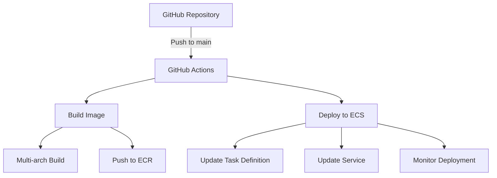

# GitHub Actions Deployment Guide

## Architecture Overview



## Components

### 1. GitHub Actions Workflow
- Triggers on push to `main` branch
- Excludes changes to documentation files
- Uses Ubuntu latest runner
- Requires AWS credentials via OIDC

### 2. Build Process
- Multi-platform build support (ARM64/AMD64)
- Uses Docker Buildx for efficient builds
- Tags images with:
  - Specific tag: `staging-{commit-sha}`
  - Latest tag: `staging`

### 3. Deployment Process
- Updates ECS task definition
- Forces new deployment
- Monitors deployment status
- Verifies service health

### 4. Security
- Uses OIDC for AWS authentication
- Implements least privilege principle
- Secure secrets management

## Required AWS Resources

1. **ECR Repository**: `web-app`
2. **ECS Cluster**: `staging-web-app-cluster`
3. **ECS Service**: `staging-web-app`
4. **IAM Roles**:
   - `ecsTaskRole`
   - `ecsTaskExecutionRole`
   - `github-actions-role`

## Required Permissions

### GitHub Actions Role
```json
{
    "Version": "2012-10-17",
    "Statement": [
        {
            "Effect": "Allow",
            "Action": [
                "ecr:*",
                "ecs:*",
                "iam:GetRole",
                "iam:PassRole",
                "logs:*"
            ],
            "Resource": [
                "arn:aws:ecr:region:account:repository/web-app",
                "arn:aws:ecs:region:account:cluster/staging-web-app-cluster",
                "arn:aws:ecs:region:account:service/staging-web-app-cluster/staging-web-app",
                "arn:aws:iam::account:role/ecsTaskRole",
                "arn:aws:iam::account:role/ecsTaskExecutionRole"
            ]
        }
    ]
}
```

## Setup Instructions

1. **Configure GitHub Repository**
   ```bash
   # Enable GitHub Actions
   Settings -> Actions -> Allow all actions
   
   # Add Repository Secrets
   Settings -> Secrets -> New repository secret
   AWS_ROLE_ARN=arn:aws:iam::account:role/github-actions-role
   ```

2. **Configure AWS Resources**
   ```bash
   # Create ECR Repository
   aws ecr create-repository --repository-name web-app
   
   # Create ECS Cluster
   aws ecs create-cluster --cluster-name staging-web-app-cluster
   
   # Create IAM Roles
   aws iam create-role --role-name ecsTaskRole
   aws iam create-role --role-name ecsTaskExecutionRole
   ```

3. **Configure OIDC in AWS**
   ```bash
   # Create OIDC Provider
   aws iam create-open-id-connect-provider \
     --url https://token.actions.githubusercontent.com \
     --thumbprint-list "list-of-thumbprints" \
     --client-id-list "sts.amazonaws.com"
   ```

## Usage Guide

### 1. Making Changes

1. Clone the repository
   ```bash
   git clone https://github.com/your-org/your-repo.git
   cd your-repo
   ```

2. Make your changes
   ```bash
   # Edit files
   vim index.html
   
   # Commit changes
   git add .
   git commit -m "Update website content"
   
   # Push to main branch
   git push origin main
   ```

### 2. Monitoring Deployment

1. Check GitHub Actions
   - Go to repository's Actions tab
   - Click on the latest workflow run
   - Monitor build and deployment progress

2. Check AWS Console
   - ECS Service Events
   - CloudWatch Logs
   - ALB Target Health

### 3. Troubleshooting

1. **Image Build Issues**
   - Check Docker build logs in GitHub Actions
   - Verify Dockerfile syntax
   - Check ECR permissions

2. **Deployment Issues**
   - Check ECS Service Events
   - Verify Task Definition
   - Check IAM Roles and Permissions

3. **Application Issues**
   - Check Container Logs
   - Verify Environment Variables
   - Check ALB Target Group Health

## Best Practices

1. **Version Control**
   - Use meaningful commit messages
   - Tag releases appropriately
   - Keep documentation updated

2. **Security**
   - Regularly rotate credentials
   - Review IAM permissions
   - Scan container images

3. **Monitoring**
   - Set up CloudWatch Alarms
   - Monitor application metrics
   - Configure logging properly

## Deployment Timeouts

The deployment monitoring is configured with the following parameters:
- Maximum wait time: 2 minutes
- Check interval: 10 seconds
- Maximum attempts: 12

To modify these settings, update the following variables in `.github/workflows/deploy.yml`:
```yaml
MAX_ATTEMPTS=12    # Number of attempts
SLEEP_TIME=10     # Seconds between attempts
```

## Support

For issues or questions:
1. Check CloudWatch Logs
2. Review GitHub Actions workflow runs
3. Contact the DevOps team

## Contributing

1. Fork the repository
2. Create a feature branch
3. Submit a pull request
4. Ensure CI passes
5. Request review
