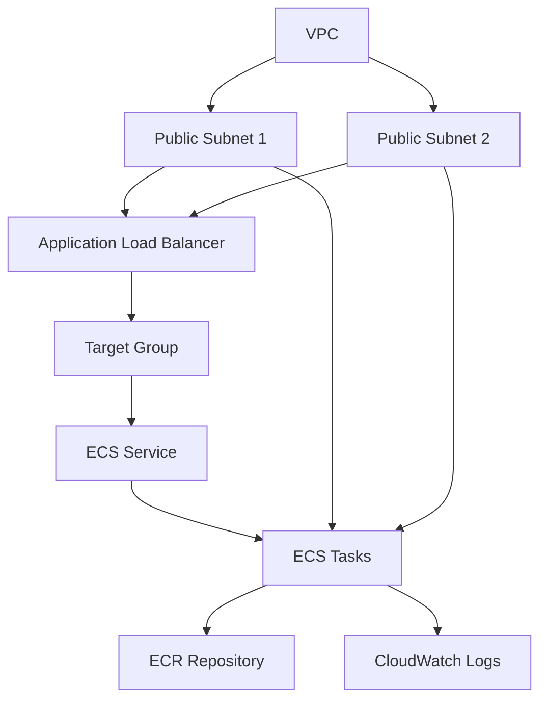

# CloudFormation Template Guide

## Overview

Template CloudFormation ini mendefinisikan infrastruktur AWS untuk menjalankan aplikasi web di ECS Fargate dengan load balancer.

## Architecture Diagram



## Template Structure

```yaml
AWSTemplateFormatVersion: '2010-09-09'
Description: ECS Fargate stack with ALB

Parameters:
  # Network Configuration
  VpcId:
    Type: AWS::EC2::VPC::Id
  SubnetIds:
    Type: List<AWS::EC2::Subnet::Id>
  
  # Application Configuration
  ServiceName:
    Type: String
    Default: staging-web-app
  ContainerPort:
    Type: Number
    Default: 80

Resources:
  # Security Groups
  ALBSecurityGroup:
    Type: AWS::EC2::SecurityGroup
    Properties:
      GroupDescription: ALB Security Group
      VpcId: !Ref VpcId
      SecurityGroupIngress:
        - IpProtocol: tcp
          FromPort: 80
          ToPort: 80
          CidrIp: 0.0.0.0/0

  ECSSecurityGroup:
    Type: AWS::EC2::SecurityGroup
    Properties:
      GroupDescription: ECS Tasks Security Group
      VpcId: !Ref VpcId
      SecurityGroupIngress:
        - IpProtocol: tcp
          FromPort: !Ref ContainerPort
          ToPort: !Ref ContainerPort
          SourceSecurityGroupId: !Ref ALBSecurityGroup

  # Load Balancer
  ApplicationLoadBalancer:
    Type: AWS::ElasticLoadBalancingV2::LoadBalancer
    Properties:
      Scheme: internet-facing
      LoadBalancerAttributes:
        - Key: idle_timeout.timeout_seconds
          Value: '60'
      SecurityGroups:
        - !Ref ALBSecurityGroup
      Subnets: !Ref SubnetIds

  # Target Group
  TargetGroup:
    Type: AWS::ElasticLoadBalancingV2::TargetGroup
    Properties:
      HealthCheckIntervalSeconds: 30
      HealthCheckPath: /
      HealthCheckProtocol: HTTP
      HealthCheckTimeoutSeconds: 5
      HealthyThresholdCount: 2
      TargetType: ip
      Port: !Ref ContainerPort
      Protocol: HTTP
      UnhealthyThresholdCount: 5
      VpcId: !Ref VpcId

  # Listener
  Listener:
    Type: AWS::ElasticLoadBalancingV2::Listener
    Properties:
      DefaultActions:
        - TargetGroupArn: !Ref TargetGroup
          Type: forward
      LoadBalancerArn: !Ref ApplicationLoadBalancer
      Port: 80
      Protocol: HTTP

  # ECS Cluster
  ECSCluster:
    Type: AWS::ECS::Cluster
    Properties:
      ClusterName: !Ref ServiceName
      ClusterSettings:
        - Name: containerInsights
          Value: enabled

  # ECS Service
  ECSService:
    Type: AWS::ECS::Service
    Properties:
      Cluster: !Ref ECSCluster
      DesiredCount: 2
      LaunchType: FARGATE
      TaskDefinition: !Ref TaskDefinition
      ServiceName: !Ref ServiceName
      NetworkConfiguration:
        AwsvpcConfiguration:
          AssignPublicIp: ENABLED
          SecurityGroups:
            - !Ref ECSSecurityGroup
          Subnets: !Ref SubnetIds
      LoadBalancers:
        - ContainerName: web-app
          ContainerPort: !Ref ContainerPort
          TargetGroupArn: !Ref TargetGroup

Outputs:
  ServiceURL:
    Description: URL of the load balancer
    Value: !Sub http://${ApplicationLoadBalancer.DNSName}
  ServiceARN:
    Description: ARN of the ECS service
    Value: !Ref ECSService
  ClusterARN:
    Description: ARN of the ECS cluster
    Value: !Ref ECSCluster
```

## Key Components

### 1. Network Configuration
- VPC dan Subnet selection
- Security Groups untuk ALB dan ECS tasks
- Public subnets untuk internet-facing ALB

### 2. Load Balancer Setup
- Application Load Balancer
- Target Group dengan health checks
- HTTP Listener pada port 80

### 3. ECS Configuration
- ECS Cluster dengan Container Insights
- Fargate Service dengan desired count 2
- Task Definition dengan container configuration

## Deployment Steps untuk Simulasi

### 1. Setup Environment

```bash
# Set environment variables
export AWS_REGION=ap-southeast-1
export STACK_NAME=web-app
export ENVIRONMENT=staging

# Dapatkan VPC ID default
VPC_ID=$(aws ec2 describe-vpcs \
  --filters "Name=isDefault,Values=true" \
  --query 'Vpcs[0].VpcId' \
  --output text \
  --region $AWS_REGION)

# Dapatkan Subnet IDs dari VPC default
SUBNET_IDS=$(aws ec2 describe-subnets \
  --filters "Name=vpc-id,Values=$VPC_ID" \
  --query 'Subnets[?MapPublicIpOnLaunch==`true`].SubnetId' \
  --output text \
  --region $AWS_REGION)
```

### 2. Validasi Template

```bash
# Validasi syntax template
aws cloudformation validate-template \
  --template-body file://template.yaml \
  --region $AWS_REGION

# Expected output:
# {
#     "Parameters": [
#         {
#             "ParameterKey": "VpcId",
#             "DefaultValue": "",
#             "NoEcho": false,
#             "Description": "ID of the VPC"
#         },
#         ...
#     ]
# }
```

### 3. Deploy Stack untuk Simulasi

```bash
# Create stack untuk simulasi
aws cloudformation create-stack \
  --stack-name $STACK_NAME \
  --template-body file://template.yaml \
  --parameters \
    ParameterKey=VpcId,ParameterValue=$VPC_ID \
    ParameterKey=SubnetIds,ParameterValue=\"${SUBNET_IDS// /,}\" \
    ParameterKey=ServiceName,ParameterValue=$ENVIRONMENT-web-app \
    ParameterKey=ContainerPort,ParameterValue=80 \
  --capabilities CAPABILITY_IAM \
  --region $AWS_REGION

# Expected output:
# {
#     "StackId": "arn:aws:cloudformation:ap-southeast-1:123456789012:stack/web-app/..."
# }
```

### 4. Monitor Deployment

```bash
# Monitor creation progress
watch -n 5 "aws cloudformation describe-stacks \
  --stack-name $STACK_NAME \
  --query 'Stacks[0].StackStatus' \
  --region $AWS_REGION"

# Expected output sequence:
# "CREATE_IN_PROGRESS"
# ...
# "CREATE_COMPLETE"
```

### 5. Verifikasi Resources

```bash
# Get stack outputs (termasuk ALB URL)
aws cloudformation describe-stacks \
  --stack-name $STACK_NAME \
  --query 'Stacks[0].Outputs' \
  --region $AWS_REGION

# Expected output:
# [
#     {
#         "OutputKey": "ServiceURL",
#         "OutputValue": "http://web-app-alb-123456789.ap-southeast-1.elb.amazonaws.com"
#     },
#     ...
# ]

# Cek ECS Service
aws ecs describe-services \
  --cluster $ENVIRONMENT-web-app \
  --services $ENVIRONMENT-web-app \
  --region $AWS_REGION

# Expected output:
# {
#     "services": [
#         {
#             "serviceName": "staging-web-app",
#             "desiredCount": 2,
#             "runningCount": 2,
#             ...
#         }
#     ]
# }
```

### 6. Test Aplikasi

```bash
# Get Service URL
SERVICE_URL=$(aws cloudformation describe-stacks \
  --stack-name $STACK_NAME \
  --query 'Stacks[0].Outputs[?OutputKey==`ServiceURL`].OutputValue' \
  --output text \
  --region $AWS_REGION)

# Test endpoint
curl -v $SERVICE_URL

# Expected output:
# * Connected to web-app-alb-123456789.ap-southeast-1.elb.amazonaws.com
# > GET / HTTP/1.1
# < HTTP/1.1 200 OK
# <!DOCTYPE html>
# <html lang="en">
#     <head>
#         <title>Cloud Engineer I'm</title>
#         ...
```

### 7. Update Stack (Jika Diperlukan)

```bash
# Update existing stack
aws cloudformation update-stack \
  --stack-name $STACK_NAME \
  --template-body file://template.yaml \
  --parameters \
    ParameterKey=VpcId,ParameterValue=$VPC_ID \
    ParameterKey=SubnetIds,ParameterValue=\"${SUBNET_IDS// /,}\" \
    ParameterKey=ServiceName,ParameterValue=$ENVIRONMENT-web-app \
    ParameterKey=ContainerPort,ParameterValue=80 \
  --capabilities CAPABILITY_IAM \
  --region $AWS_REGION

# Monitor update
watch -n 5 "aws cloudformation describe-stack-events \
  --stack-name $STACK_NAME \
  --query 'StackEvents[0]' \
  --region $AWS_REGION"
```

### 8. Cleanup Simulasi

```bash
# Delete stack dan semua resources
aws cloudformation delete-stack \
  --stack-name $STACK_NAME \
  --region $AWS_REGION

# Monitor deletion
watch -n 5 "aws cloudformation describe-stacks \
  --stack-name $STACK_NAME \
  --query 'Stacks[0].StackStatus' \
  --region $AWS_REGION"

# Expected output sequence:
# "DELETE_IN_PROGRESS"
# ...
# "DELETE_COMPLETE"
```

## Parameter Configuration

| Parameter | Description | Default |
|-----------|-------------|---------|
| VpcId | ID of the VPC | Required |
| SubnetIds | List of subnet IDs | Required |
| ServiceName | Name of the ECS service | staging-web-app |
| ContainerPort | Container port | 80 |

## Best Practices

### 1. Security
- Use security groups to restrict access
- Enable Container Insights for monitoring
- Configure proper health checks
- Use private subnets when possible

### 2. High Availability
- Deploy across multiple AZs
- Use multiple tasks for redundancy
- Configure proper health check thresholds

### 3. Monitoring
- Enable Container Insights
- Set up CloudWatch alarms
- Monitor service metrics

### 4. Cost Optimization
- Use Fargate Spot for non-critical workloads
- Right-size task resources
- Monitor and adjust capacity

## Troubleshooting

### 1. Stack Creation Fails
- Check VPC/Subnet configuration
- Verify IAM permissions
- Review CloudFormation events

### 2. Service Won't Start
- Check security group rules
- Verify subnet configuration
- Review task definition

### 3. Health Checks Failing
- Verify application is responding
- Check security group rules
- Review health check settings

## Related Documentation

- [TASK_DEFINITION_GUIDE.md](./TASK_DEFINITION_GUIDE.md) - ECS Task Definition configuration
- [GITHUB_ACTIONS_GUIDE.md](./GITHUB_ACTIONS_GUIDE.md) - CI/CD pipeline
- [role-aws/](../role-aws/) - IAM roles and policies

## Updates and Maintenance

1. **Version Control**
   - Keep template in version control
   - Document all changes
   - Use change sets for updates

2. **Testing**
   - Test in development environment
   - Use change sets to preview changes
   - Validate template before deployment

3. **Backup and Recovery**
   - Keep template backups
   - Document rollback procedures
   - Test recovery processes
