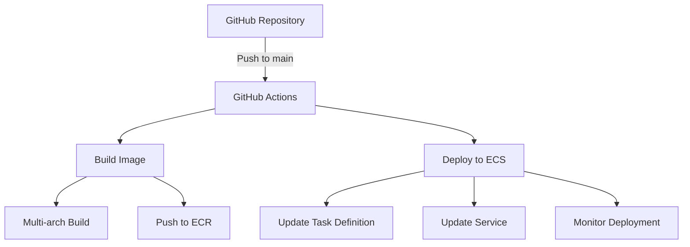

# GitHub Actions Deployment Guide

## Architecture Overview



## Components

### 1. GitHub Actions Workflow
- Triggers on push to `main` branch
- Excludes changes to documentation files
- Uses Ubuntu latest runner
- Requires AWS credentials via OIDC

### 2. Build Process
- Multi-platform build support (ARM64/AMD64)
- Uses Docker Buildx for efficient builds
- Tags images with:
  - Specific tag: `staging-{commit-sha}`
  - Latest tag: `staging`

### 3. Deployment Process
- Updates ECS task definition
- Forces new deployment
- Monitors deployment status
- Verifies service health

### 4. Security
- Uses OIDC for AWS authentication
- Implements least privilege principle
- Secure secrets management

## Required AWS Resources

1. **ECR Repository**: `web-app`
2. **ECS Cluster**: `staging-web-app-cluster`
3. **ECS Service**: `staging-web-app`
4. **IAM Roles**:
   - `ecsTaskRole` (see `/role-aws/ecs-task-role-policy.json`)
   - `ecsTaskExecutionRole` (see `/role-aws/ecs-task-execution-policy.json`)
   - `github-actions-role` (see `/role-aws/github-actions-policy.json`)

## Required Permissions

### GitHub Actions Role
See full policy in `/role-aws/github-actions-policy.json`

Key permissions:
```json
{
    "Version": "2012-10-17",
    "Statement": [
        {
            "Effect": "Allow",
            "Action": [
                "ecr:*",
                "ecs:*",
                "iam:GetRole",
                "iam:PassRole",
                "logs:*"
            ],
            "Resource": [
                "arn:aws:ecr:region:account:repository/web-app",
                "arn:aws:ecs:region:account:cluster/staging-web-app-cluster",
                "arn:aws:ecs:region:account:service/staging-web-app-cluster/staging-web-app"
            ]
        }
    ]
}
```

## Setup Instructions

1. **Configure GitHub Repository**
   ```bash
   # Enable GitHub Actions
   Settings -> Actions -> Allow all actions
   
   # Add Repository Secrets
   Settings -> Secrets -> New repository secret
   AWS_ROLE_ARN=arn:aws:iam::account:role/github-actions-role
   ```

2. **Configure AWS Resources**
   ```bash
   # Create ECR Repository
   aws ecr create-repository --repository-name web-app
   
   # Create ECS Cluster
   aws ecs create-cluster --cluster-name staging-web-app-cluster
   
   # Create IAM Roles using policies in /role-aws/
   aws iam create-role --role-name ecsTaskRole --assume-role-policy-document file://role-aws/task-role-trust-policy.json
   aws iam put-role-policy --role-name ecsTaskRole --policy-name ecsTaskPolicy --policy-document file://role-aws/ecs-task-role-policy.json
   
   aws iam create-role --role-name ecsTaskExecutionRole --assume-role-policy-document file://role-aws/task-role-trust-policy.json
   aws iam put-role-policy --role-name ecsTaskExecutionRole --policy-name ecsTaskExecutionPolicy --policy-document file://role-aws/ecs-task-execution-policy.json
   ```

3. **Configure OIDC in AWS**
   ### 1. Create or Update OIDC Provider

   ```bash
   # Create OIDC Provider (jika belum ada)
   aws iam create-open-id-connect-provider \
     --url https://token.actions.githubusercontent.com \
     --thumbprint-list "6938fd4d98bab03faadb97b34396831e3780aea1" \
     --client-id-list "sts.amazonaws.com"

   # Jika provider sudah ada, dapatkan ARN
   OIDC_PROVIDER_ARN=$(aws iam list-open-id-connect-providers \
     --query 'OpenIDConnectProviderList[?contains(Arn, `token.actions.githubusercontent.com`)].Arn' \
     --output text)

   echo "OIDC Provider ARN: $OIDC_PROVIDER_ARN"
   ```

   ### 2. Create IAM Role for GitHub Actions

   ```bash
   # Create trust policy
   cat > trust-policy.json << 'EOF'
   {
       "Version": "2012-10-17",
       "Statement": [
           {
               "Effect": "Allow",
               "Principal": {
                   "Federated": "arn:aws:iam::617692575193:oidc-provider/token.actions.githubusercontent.com"
               },
               "Action": "sts:AssumeRoleWithWebIdentity",
               "Condition": {
                   "StringEquals": {
                       "token.actions.githubusercontent.com:aud": "sts.amazonaws.com"
                   },
                   "StringLike": {
                       "token.actions.githubusercontent.com:sub": "repo:your-org/your-repo:*"
                   }
               }
           }
       ]
   }
   EOF

   # Create role
   aws iam create-role \
     --role-name github-actions-role \
     --assume-role-policy-document file://trust-policy.json

   # Attach necessary policies
   aws iam put-role-policy \
     --role-name github-actions-role \
     --policy-name github-actions-policy \
     --policy-document file://role-aws/github-actions-policy.json
   ```

   ### 3. Configure GitHub Repository

   1. Go to repository settings
   2. Navigate to Secrets and variables > Actions
   3. Add new repository secret:
     - Name: `AWS_ROLE_ARN`
     - Value: `arn:aws:iam::617692575193:role/github-actions-role`

   ### 4. Verify Configuration

   ```bash
   # Test role assumption
   aws sts assume-role-with-web-identity \
     --role-arn arn:aws:iam::617692575193:role/github-actions-role \
     --role-session-name "GitHubActions" \
     --web-identity-token "token" \
     --duration-seconds 900
   ```
   

   ### Notes:
   - Thumbprint `6938fd4d98bab03faadb97b34396831e3780aea1` adalah valid untuk GitHub Actions
   - Ganti `your-org/your-repo` dengan nama organisasi dan repository Anda
   - Role ARN akan berbeda sesuai dengan AWS account Anda

## GitHub Actions Guide

### Prerequisites

1. **IAM Role**
   - Role name: `github-actions-role`
   - Trust relationship dengan GitHub OIDC provider
   - Required permissions:
     ```json
     {
         "Version": "2012-10-17",
         "Statement": [
             {
                 "Effect": "Allow",
                 "Action": [
                     "ecr:GetAuthorizationToken",
                     "ecr:BatchCheckLayerAvailability",
                     "ecr:GetDownloadUrlForLayer",
                     "ecr:BatchGetImage",
                     "ecr:PutImage",
                     "ecr:InitiateLayerUpload",
                     "ecr:UploadLayerPart",
                     "ecr:CompleteLayerUpload",
                     "ecs:DescribeServices",
                     "ecs:UpdateService",
                     "ecs:RegisterTaskDefinition",
                     "ecs:DescribeTaskDefinition",
                     "iam:GetRole",
                     "iam:PassRole",
                     "cloudformation:*"
                 ],
                 "Resource": "*"
             }
         ]
     }
     ```

2. **ECS Roles**
   - Execution Role: `staging-web-app-execution-role`
     - Used for both task execution and task role
     - Must have permissions for:
       - Pulling ECR images
       - Writing CloudWatch logs
       - Any other permissions needed by the container

3. **GitHub Repository Secrets**
   - `AWS_ROLE_ARN`: ARN dari IAM role untuk GitHub Actions

### Common Issues

1. **IAM PassRole Error**
   ```
   User is not authorized to perform: iam:PassRole
   ```
   
   **Solution:**
   - Pastikan GitHub Actions role memiliki permission `iam:PassRole`
   - Verifikasi policy sudah diupdate dengan command:
     ```bash
     aws iam get-role-policy \
       --role-name github-actions-role \
       --policy-name github-actions-policy
     ```

2. **Task Role Error**
   ```
   Invalid type for parameter taskRoleArn
   ```
   
   **Solution:**
   - Pastikan execution role sudah dibuat dan valid
   - Verifikasi role ARN dengan command:
     ```bash
     aws iam get-role \
       --role-name staging-web-app-execution-role
     ```

### Troubleshooting Steps

1. **Cek GitHub Actions Logs**
   - Buka repository di GitHub
   - Klik tab "Actions"
   - Pilih workflow run yang gagal
   - Expand step yang error untuk melihat detail

2. **Verifikasi IAM Role**
   ```bash
   # Cek role
   aws iam get-role --role-name github-actions-role
   
   # Cek policy
   aws iam get-role-policy \
     --role-name github-actions-role \
     --policy-name github-actions-policy
   ```

3. **Cek Task Definition**
   ```bash
   # List task definitions
   aws ecs list-task-definitions
   
   # Describe specific task definition
   aws ecs describe-task-definition \
     --task-definition FAMILY_NAME:REVISION
   ```

4. **Monitor Deployment**
   ```bash
   # Cek service status
   aws ecs describe-services \
     --cluster CLUSTER_NAME \
     --services SERVICE_NAME
   ```

## Usage Guide

### 1. Making Changes

1. Clone the repository
   ```bash
   git clone https://github.com/your-org/your-repo.git
   cd your-repo
   ```

2. Make your changes
   ```bash
   # Edit files
   vim index.html
   
   # Commit changes
   git add .
   git commit -m "Update website content"
   
   # Push to main branch
   git push origin main
   ```

### 2. Monitoring Deployment

1. Check GitHub Actions
   - Go to repository's Actions tab
   - Click on the latest workflow run
   - Monitor build and deployment progress

2. Check AWS Console
   - ECS Service Events
   - CloudWatch Logs
   - ALB Target Health

### 3. Troubleshooting

1. **Image Build Issues**
   - Check Docker build logs in GitHub Actions
   - Verify Dockerfile syntax
   - Check ECR permissions

2. **Deployment Issues**
   - Check ECS Service Events
   - Verify Task Definition
   - Check IAM Roles and Permissions

3. **Application Issues**
   - Check Container Logs
   - Verify Environment Variables
   - Check ALB Target Group Health

## Project Structure

```
.
├── .github/
│   └── workflows/
│       └── deploy.yml      # GitHub Actions workflow
├── documentation/
│   ├── GITHUB_ACTIONS_GUIDE.md  # This guide
│   └── other-docs.md      # Other documentation
├── role-aws/
│   ├── github-actions-policy.json    # GitHub Actions IAM policy
│   ├── ecs-task-role-policy.json     # ECS Task Role policy
│   ├── ecs-task-execution-policy.json # ECS Task Execution Role policy
│   └── task-role-trust-policy.json   # Trust policy for ECS roles
├── Dockerfile             # Container image definition
├── nginx.conf            # Nginx configuration
└── index.html            # Web application entry point
```

## Best Practices

1. **Version Control**
   - Use meaningful commit messages
   - Tag releases appropriately
   - Keep documentation updated

2. **Security**
   - Regularly rotate credentials
   - Review IAM permissions
   - Scan container images

3. **Monitoring**
   - Set up CloudWatch Alarms
   - Monitor application metrics
   - Configure logging properly

## Deployment Timeouts

The deployment monitoring is configured with the following parameters:
- Maximum wait time: 3.33 minutes
- Check interval: 10 seconds
- Maximum attempts: 20

To modify these settings, update the following variables in `.github/workflows/deploy.yml`:
```yaml
MAX_ATTEMPTS=20    # Number of attempts
SLEEP_TIME=10     # Seconds between attempts
```

## Support

For issues or questions:
1. Check CloudWatch Logs
2. Review GitHub Actions workflow runs
3. Contact the DevOps team

## Contributing

1. Fork the repository
2. Create a feature branch
3. Submit a pull request
4. Ensure CI passes
5. Request review
