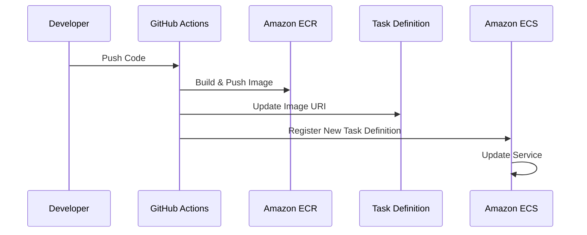

# ECS Task Definition Guide

## Overview

Task Definition adalah blueprint untuk aplikasi Anda di ECS. File ini menentukan bagaimana container Anda akan berjalan di ECS cluster.

## Sequence Diagram



## Workflow Steps

1. **Build Image** (Prerequisites)
   - Push code ke repository
   - GitHub Actions build Docker image
   - Push image ke ECR

2. **Update Task Definition**
   - Ambil task definition yang ada
   - Update image URI dengan yang baru
   - Register task definition baru

3. **Deploy ke ECS**
   - Update service dengan task definition baru
   - Monitor deployment
   - Verifikasi health checks

## Task Definition Structure

```json
{
    "family": "staging-web-app",
    "containerDefinitions": [
        {
            "name": "web-app",
            "image": "ACCOUNT.dkr.ecr.REGION.amazonaws.com/web-app:TAG",
            "cpu": 256,
            "memory": 512,
            "portMappings": [
                {
                    "containerPort": 80,
                    "hostPort": 80,
                    "protocol": "tcp"
                }
            ],
            "essential": true,
            "healthCheck": {
                "command": ["CMD-SHELL", "curl -f http://localhost/ || exit 1"],
                "interval": 30,
                "timeout": 5,
                "retries": 3
            },
            "logConfiguration": {
                "logDriver": "awslogs",
                "options": {
                    "awslogs-group": "/ecs/staging-web-app",
                    "awslogs-region": "REGION",
                    "awslogs-stream-prefix": "ecs"
                }
            }
        }
    ],
    "requiresCompatibilities": ["FARGATE"],
    "networkMode": "awsvpc",
    "cpu": "256",
    "memory": "512",
    "executionRoleArn": "arn:aws:iam::ACCOUNT:role/ecsTaskExecutionRole",
    "taskRoleArn": "arn:aws:iam::ACCOUNT:role/ecsTaskRole"
}
```

## Key Components

### 1. Container Definition
- **name**: Nama container
- **image**: URI image di ECR
- **cpu/memory**: Resource allocation
- **portMappings**: Port yang diexpose
- **healthCheck**: Konfigurasi health check
- **logConfiguration**: Konfigurasi CloudWatch logs

### 2. Network Configuration
- **networkMode**: "awsvpc" untuk Fargate
- **requiresCompatibilities**: ["FARGATE"]

### 3. Resource Allocation
- **cpu**: CPU units (256 = 0.25 vCPU)
- **memory**: Memory dalam MB

### 4. IAM Roles
- **executionRoleArn**: Role untuk pull image dan logs
- **taskRoleArn**: Role untuk aplikasi

## Cara Penggunaan

### 1. Register Task Definition Baru

```bash
# Validasi task definition
aws ecs register-task-definition \
  --cli-input-json file://task-definition.json \
  --region REGION

# Dapatkan revision terbaru
TASK_DEFINITION_ARN=$(aws ecs describe-task-definition \
  --task-definition staging-web-app \
  --query 'taskDefinition.taskDefinitionArn' \
  --output text \
  --region REGION)
```

### 2. Update Service

```bash
# Update service dengan task definition baru
aws ecs update-service \
  --cluster staging-web-app-cluster \
  --service staging-web-app \
  --task-definition $TASK_DEFINITION_ARN \
  --region REGION
```

### 3. Monitor Deployment

```bash
# Monitor service events
aws ecs describe-services \
  --cluster staging-web-app-cluster \
  --services staging-web-app \
  --query 'services[0].events[0:5]' \
  --region REGION
```

## Best Practices

1. **Version Control**
   - Simpan task definition di repository
   - Track perubahan dengan git
   - Gunakan tag spesifik untuk image

2. **Resource Management**
   - Set CPU/memory sesuai kebutuhan
   - Monitor resource usage
   - Adjust berdasarkan metrics

3. **Security**
   - Gunakan least privilege untuk roles
   - Enable log encryption
   - Regular security updates

4. **Monitoring**
   - Set health check yang tepat
   - Configure CloudWatch alarms
   - Monitor container metrics

## Troubleshooting

### 1. Task Tidak Bisa Start
- Cek IAM roles dan permissions
- Verifikasi image URI
- Cek resource constraints

### 2. Health Check Gagal
- Verifikasi health check command
- Cek application logs
- Periksa security groups

### 3. Resource Issues
- Monitor CPU/memory usage
- Adjust resource allocation
- Check for memory leaks

## Related Documentation

- [GITHUB_ACTIONS_GUIDE.md](./GITHUB_ACTIONS_GUIDE.md) - GitHub Actions workflow
- [role-aws/ecs-task-role-policy.json](../role-aws/ecs-task-role-policy.json) - Task role permissions
- [role-aws/ecs-task-execution-policy.json](../role-aws/ecs-task-execution-policy.json) - Execution role permissions
