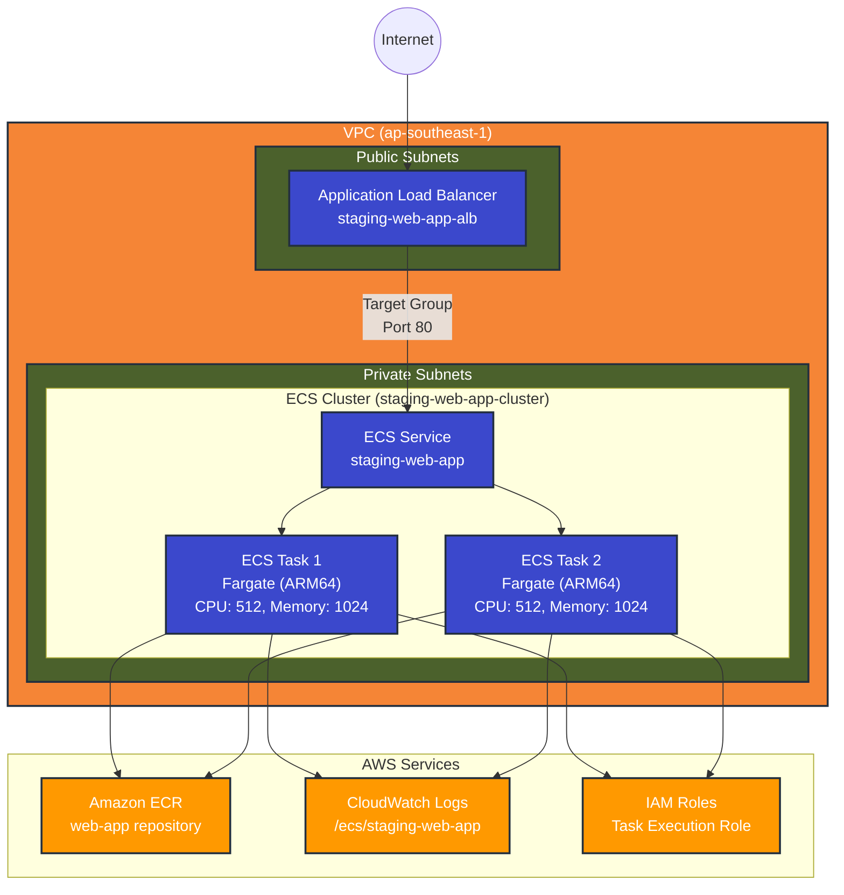

## Architecture Diagram

### Architecture Components

1. **VPC and Networking**
   - VPC in ap-southeast-1 region
   - Public subnets for ALB
   - Private subnets for ECS tasks
   - Internet Gateway for public access

2. **Load Balancer**
   - Application Load Balancer (ALB)
   - Internet-facing
   - Listens on port 80
   - Routes traffic to ECS tasks

3. **ECS Cluster**
   - Cluster Name: staging-web-app-cluster
   - Service Name: staging-web-app
   - 2 Fargate tasks
   - ARM64 architecture
   - Task resources: 512 CPU units, 1024MB memory

4. **Container Infrastructure**
   - ECR repository for container images
   - CloudWatch Logs for container logging
   - IAM roles for task execution

5. **Security**
   - Security groups for ALB and ECS tasks
   - IAM roles with least privilege
   - Private subnets for ECS tasks
